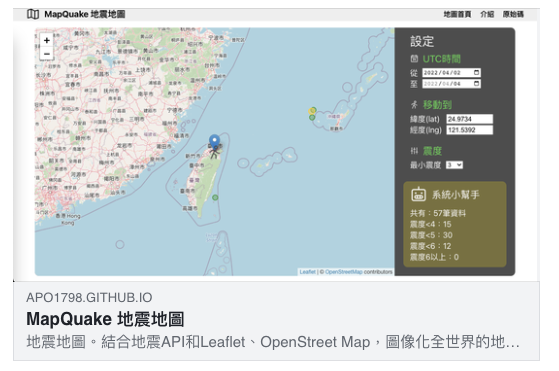
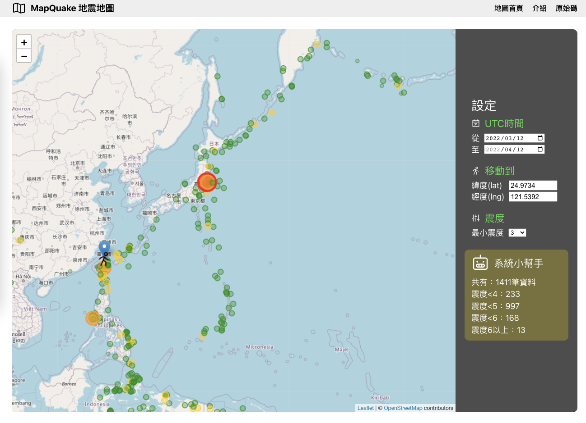

# MapQuake 地震地圖

## [網站連結](https://apo1798.github.io/map-quake/)

### 地震地圖。結合地震 API 和 React Leaflet，圖像化全世界的地震，調整日期與震度客製化你想要的地震資料。

### API 與工具庫

- 地震 API 使用美國地質調查局(United States Geological Survey, 簡稱 USGS)資料。
- React
- React Leaflet
- @reduxjs/toolkit
- React DOM, React Helmet

---

#### 2022/04/12 更新記事

- 使用 Redux Toolkit 替代 React Context API，分成多個 slice。
- 減少 CSS media query 使用。
- 嘗試使用 React Helmet。
- 網站圖標加上背景，讓容易在瀏覽器黑暗模式辨識。
- 增加** OG** 標籤。
- 導覽列使用響應式漢堡選單。

### New feature playground





> 這是引用文字喔！
>
> > 再引用一次

```JavaScript
console.log('Welcome to JavaScript!');
import PagePagination from "../components/UI/PagePagination"
for (const i = 0; i < 100, i++) {
  console.log(i)
}
import react from 'React';
```
