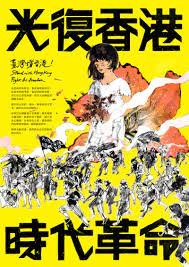

# 文宣介紹

> 文宣一方面提醒示威者過往與將來的事件，也更讓反送中運動有更深層的共同記憶，在精神與情緒上，也更加深了抗爭者的革命情感。

---

## 引言與意義

講到香港反送中運動，或許我們心中想到的是煙霧瀰漫的香港街道、烽火連天的中大校園、防暴警察在街道上追捕抗爭者的畫面。然而除了這些動態的抗爭外，香港遍地開花的連儂牆則展現了靜態的一面，在香港的地下道、人行天橋、甚至政府機關的外牆上，支持運動的人貼上了一張張的便利貼，上頭寫著自身的想法、抑或是抗爭的標語；有人貼上了 A4 大小，或者是用 A4 紙張拼貼而出的大型文宣，印刷的是精美的設計圖，內容可能是下兩週的抗爭時間表，也可能是新聞影片截圖佐以文字說明警方不適當的暴力等。

### 長度

根據教育部國語字典，文宣兩字意指「文字宣傳」，因此只要透過文字表達特定理念即可被稱為文宣，長則一篇文章，短則一個字如「罷」。  
然而，筆者認為現在文宣的定義應當更廣泛，不僅僅只限於實體文字，藝術繪畫或卡通圖像也可達到宣傳效果，例如描繪示威場景的畫作，或是一隻連登豬都表達了支持示威者的立場；此外，隨著網際網路的進步，雲端、聊天軟體備份與共享更為便利。

文宣不僅只在實體連儂牆開花綻放，在虛擬的網路世界中，小自個人經營的臉書、IG 帳號，大自上萬多人的聊天室、粉絲專頁，我們也可以看見文宣的身影。此外，在示威者在街道上的噴漆塗鴉也可算是文宣的一部分。

### 方向性

網路媒體明日誌(2019)討論了過往平面設計的特點與近年的轉向，平面設計「透過海報、酷卡、塗鴉等各種不同形式，成為政治宣傳(propaganda)的利器」，而且這些宣傳方向往往是由上而下（政府至人民），例如由 James Montgomery 所設計的美國徵兵海報，便是平面設計由上至下表達政治理念的例子。然而自 60 年代後，各種運動百花綻放，進而有藝術家開始藉由平面創作來揶揄政治人物，如同在柏林圍牆東側著名的「社會主義兄弟之吻」，創作者`弗魯貝爾`在當時僅是一名大學生，等等創作反轉了過往平面設計只能由上而下的方向性。

## 連儂牆與網路文宣平台的關係

### 起源

連儂牆是一個非常重要的濫觴，扮演了兩個截然不同的角色，它是一個言論表達空間，抗爭者可在此書寫訴求、張貼文宣、抒發情緒；它也是一個傳遞言論的空間，文宣貼在公共空間，受眾並不侷限在抗爭者，而是能擴及到無特定立場、甚至是親政府的市民，短暫的駐足，甚至僅是看了一眼，就達到了連儂牆身為言論傳遞者的角色。

### 網路

然而為求各地連儂牆都能開花，貼滿抗爭的文宣，分享於公共平台供他人下載便十分重要，也在此原因之下，網路文宣平台迅速受到重視，因應而生的是各個具有設計感、不同理念的文宣。雖然說當初連儂牆的實體文宣需求是網路文宣平台的重要起因，但現在則是連儂牆與網路文宣平台，一則**實體一則虛擬**，相互並行，各有各自的受眾與優點。

#### 突破原有受眾

文宣意在宣傳，受眾與內容均十分的重要。以受眾來說，連儂牆的受眾是不特定對象，更能夠突破同溫層，讓一般市民了解抗爭者立場，進而支持。然而收看虛擬文宣的人，大多是透過訂閱粉絲專頁，加入聊天群組，抑或是朋友轉發，如此文宣便難以突破示威者的同質團體，表達給那些意見相左的人。（當然這個文宣的內容也有關係，有些文宣內容是如何準備抗爭裝備，其目標受眾為前線抗爭者則非一般市民；有些則是說明為何抗爭者要破壞公共設施等，其目標受眾便是一般或親政府市民。）

##### 種類

###### 以創作者來區分

1. 設計文宣

- 管理員、設計師（方向多是單向）
- 實體與虛擬
- 網路平台不易破壞、易保存
- 傳遞成本很低，接收與分享變得更容易

2. 便利貼與筆

- 每個人透過書寫與繪畫（雙向）
- 實體
- 易流失、破壞

###### 以內容來區分

1. 標語型文宣

綜觀來看標語型的文宣從抗爭開始至今，一直都扮演著非常重要的角色，簡單的一兩句話，配上可愛的 Pepe、連登豬等，就可以是一張文宣。隨著抗爭訴求的不同，標語也時時在換，從一開始的「反送中，抗惡法」、至中期的「五大訴求、缺一不可」、「光復香港、時代革命」、至近期的「香港獨立，唯一出路」等。

2. 日程型文宣

此種又可以再細分成日程表與單一事件。香港人日程表會統整近期的各地活動與集會，並以日期區分。而單一事件則是以該事件為主題，附有活動主題、時間、地點等。兩者的目的均是號招群眾一同來參與。

3. 知識型文宣

身為抗爭者，不可不知抗爭事。然而各位初出茅廬的新手，若沒有抗爭常識恐怕只會白白送頭。然而專業知識的整理與宣傳，透過文宣組之手，大多以懶人包圖集放送，內容包羅萬象，有的提及抗爭手勢、警察分類、如何以行動支持黃色經濟圈，更有的包含上法庭聆聽手足判決時該注意哪些禮節。這些知識型文宣為抗爭者做了預先演練，讓抗爭時更能夠從容應對任何突發狀況。

4. 文字創作型文宣

除了前面提到的反轉字之外，中文字共通的部首或形狀等也被拿來作文字的二次創作，有些是將多個字和體成為一個字、有的則是在原有的字中標註特定部分，找出新的字。這些結合除了展現創意以外，更傳達了因為字與字之間共享為些筆順（或部首），其關係密不可分。如同香港二字中我們找到了反抗，便表示香港與反抗的關係是相當緊密的。

5. 繪畫型文宣

繪畫型文宣以手繪或電繪單圖型式紀錄抗爭者的日常生活、警方的執法暴力、或政府官員的腐敗等。除了單純的實景再現外，有些也會結合文學象徵或過往經典藝文作品等等，例如香港抗爭者版本的〈自由領導人民〉。

6. 國際型文宣

文宣不僅僅傳遞給香港民眾與政府，亦透過翻譯文字傳達至國際，是國際陣線中重要的一環。國際翻譯文宣中最常見的為英文版，日文、西文、葡萄牙文亦常見，而其他東南亞或阿拉伯文等則很少見。英文版為全國通用語言，為各類翻譯文宣之首。而其他與香港地理位置相近的國家亦是翻譯文宣主要輸出對象。

