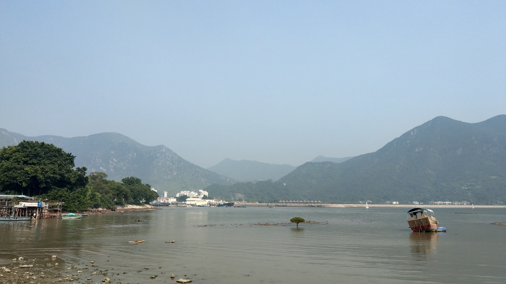
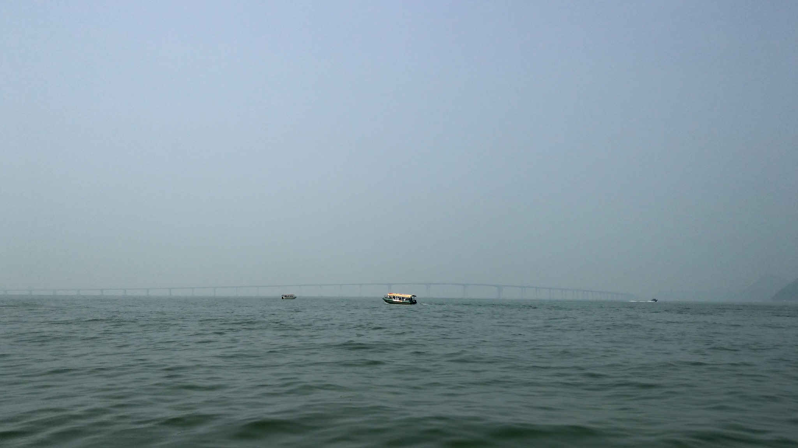

# 4 月 16 日香港記事

來打打在香港的一些見聞。

4 月 16 日跟著學校的旅行團去了大澳，別名「香港威尼斯」。大澳在新界大嶼山的西北方，交通不甚方便，陸上交通要透過北大嶼山公路再經東浦道往南，開過山路後經過石壁再向北行才能到達大澳（有點像正方形 ABCD，不能直接從 A 到 D 點時，得經過 B、C 兩點的感覺）。海上交通則是可從屯門搭船，普通船約需 90 分鐘、快船則須 55 分鐘。

大澳上腳踏車很多，居民、郵差都以腳踏車代步，而且當地居民都習慣用連環的鈴鐺聲趕人、要你讓路，甚至連電動輪椅也配備鈴鐺，便可知道鈴鐺是大澳的語言。街上有許多販賣南北貨、鮮魚的商家，這裡的消暑品是冰凍菠蘿(鳳梨)、冰凍西瓜，一枝 15 元。沿路也有許多賣冷飲的小販，並非是用冰箱，而是用冰塊與保溫桶。有趣的是大澳島上有間少林武術文化中心，學校還安排了打拳活動。

中午吃飯時外國學生不停在抱怨白斬雞、鮮魚有骨頭（難以想像小弟我的朋友們在他們眼中都是挑骨頭大師），還問同行的香港人是不是會吃雞頭，不然白斬雞為什麼要附頭。

旅程中還有親製鹹蛋黃與海上觀豚。鹹蛋黃是用鴨蛋蛋黃撒上鹽放置太陽底下曬，沒有甚麼過於高超的技巧，只須留心別把蛋黃弄破與確實分開蛋白，再而把蛋黃放在竹簍上並撒上鹽就完成了，曬的過程中會把蛋黃翻面繼續曬乾，不會曬至全乾，以保留些許水分。

走在大澳街市，特別是在橋的兩旁，有許多人招攬遊客去搭船觀豚，學校也有安排，但當天因為台灣打風（颱風），香港天氣非常的好，但也意味著空氣品質很糟，能見度不高。除了遠端曖昧不明的港珠澳大橋以外，也沒什麼可以看的。但搭船卻很新奇有趣。

在大澳最常見的就是棚屋了，以竹子為底座架在岸旁的房屋，下面就停泊著船隻。根據旅遊發展局，部分棚屋戶戶相連，走道甚至穿過鄰居的客廳或廚房，營造了親近的鄰里關係。
