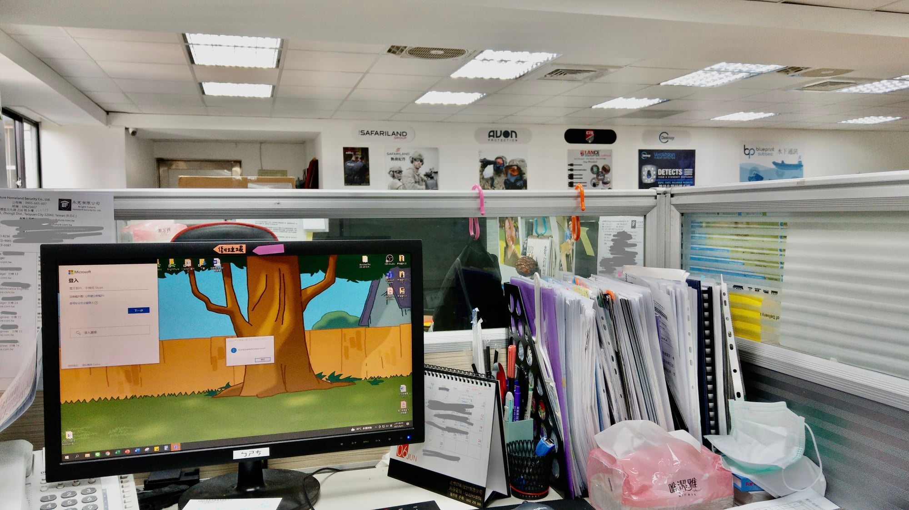
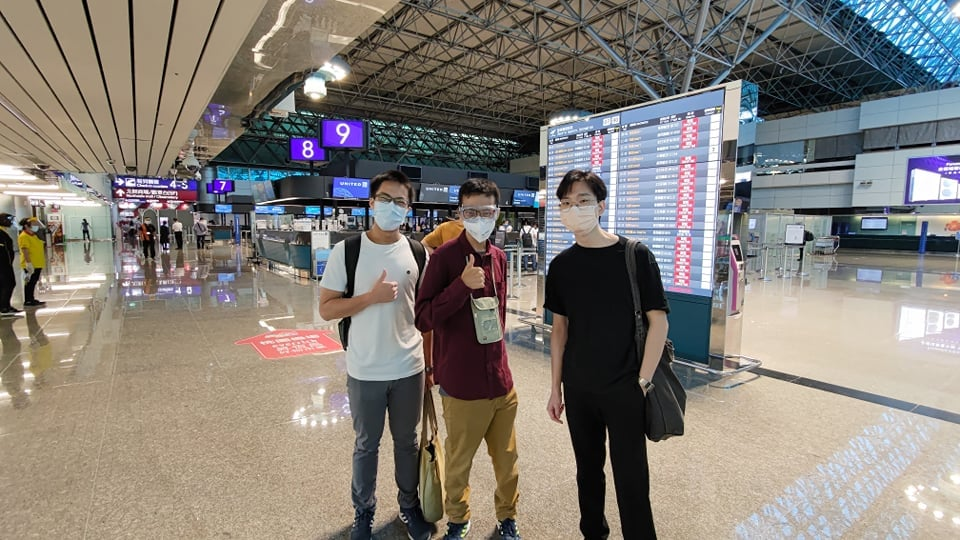

#### 2021 轉眼要邁入尾聲了。今年轉換了好多身分，想法上有不少的衝擊，也重拾了不少人生目標。

### 去年 11/17-今年 3/5 宜蘭金六結服役

太多的鳥事，幸好荒唐的生活已經成為說嘴的回憶。但很開心結交到很多志同道合的朋友，好多位鄰兵退伍之後仍然保持聯絡，給了我很多建議甚至成為工作路上的好夥伴。在冬日多雨的蘭陽平原，看到大家不同的性格、價值、對未來的憧憬，這些片段會好好收在心裡。

### 4/19-5/16 第一份工作、蘋果日報編輯

沒錯，入職不到一個月就被資遣了。說來荒謬但這就是人生。雖然只是短短的一個月，也大概把編輯的流程跑順了。報紙出版的最後一天，主管叫了炸雞、飲料，美編部門還叫了港式小點心，愉悅的氣氛讓人感覺不到被裁員的傷感。（那個時候正值疫情高峰期，大家載歌載舞都沒染疫真的感謝保佑。）5/17 零時下班後，拿著我的家當與大家告別（真的就是手裡抱著紙箱），走向夜晚的內湖街道，沒有車輛，只剩高聳的大樓正沉睡著。

### 5/24-9/30 中壢貿易代理商英文秘書

馬不停蹄的往下，輾轉到了中壢一家專做專業軍用品的貿易代理商。我的前輩突然離職公司急需人，小弟我這隻小白兔就這樣誤入森林。（現在想想老闆的心臟也很大顆，敢雇用一個完全沒相關經驗的我。）一開始的生活真的非常辛苦，很多事情我要一肩扛，在 try and error 的模式下成長，幸好後來漸入佳境，也認識到很多好同事，遇到麻煩時互相苦笑，再繼續埋頭想辦法。後來因為某些原因離職，但也學到了一家公司大概的運作生態。

6/21 我工作的桌子。上班太苦悶只好把桌面改成飛哥與小佛經典後院。

9/22 心耕哥出國深究送機，祝學成歸國。

### 10/1- 迷茫但再繼續找方向、前進

回到就業市場的我，想再個自己一次嘗試媒體業的機會。唯相關需求真的太飽和。現在在準備轉職中，不一定會成功但就給自己一個努力的方向。待明年有什麼下文會再跟大家分享的（不論成功或失敗）。且待下回分解。

### 今年的嘗試：

1. 開始重回學琴之路。
2. 開始認真跑步，之前跑半馬都佛系練習。希望明年二月的台北渣打馬拉松不當步兵跑完全程。

### 明年可以嘗試：

1. 跑人生初馬
2. 持續紀錄、分享
3. 報名日文補習班
4. 學會游泳
5. 願轉職順利

上面這些目標尚需方法跟環境。We’ll find how to make it.  
感謝大家這一年的指教，與我碰面的大家，希望明年再攜手向前。
